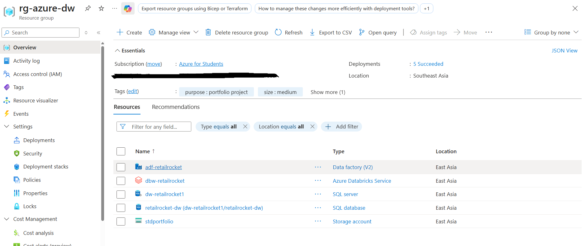
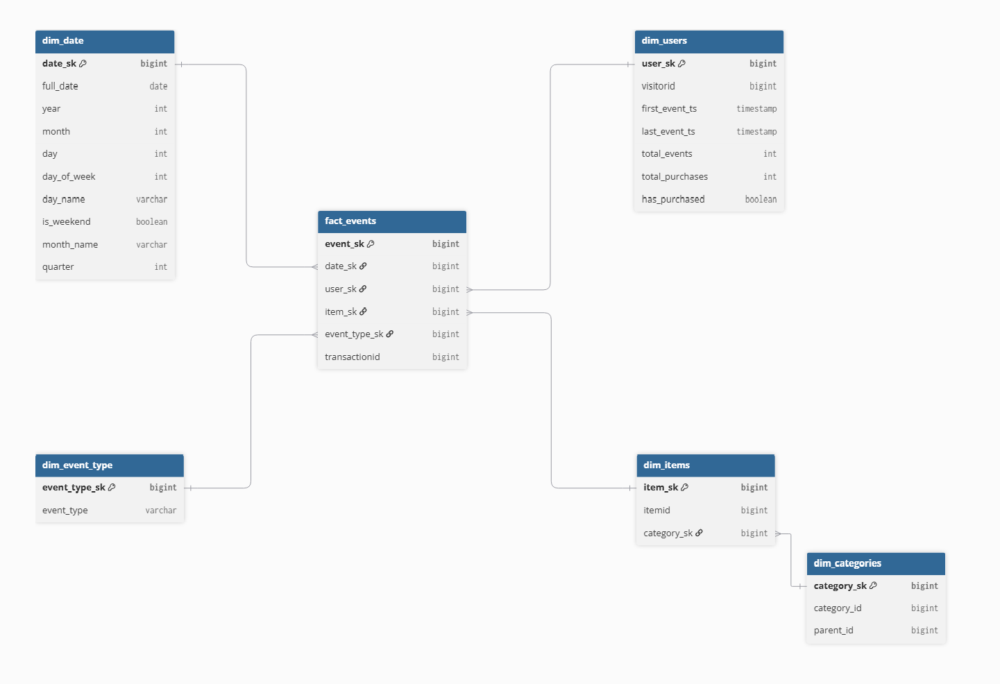
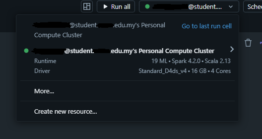
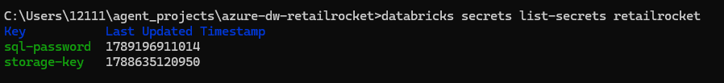
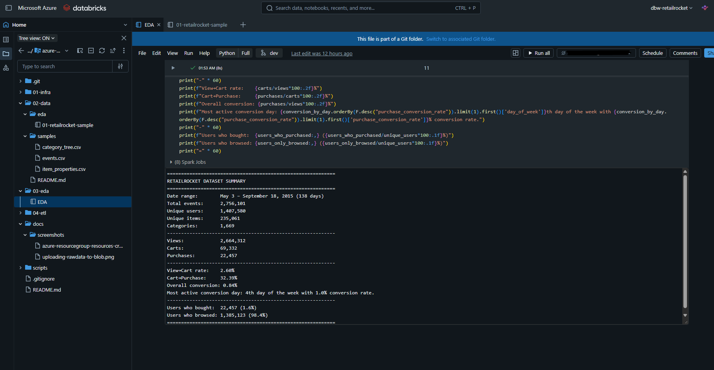
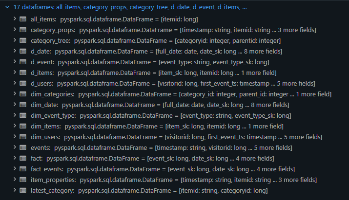
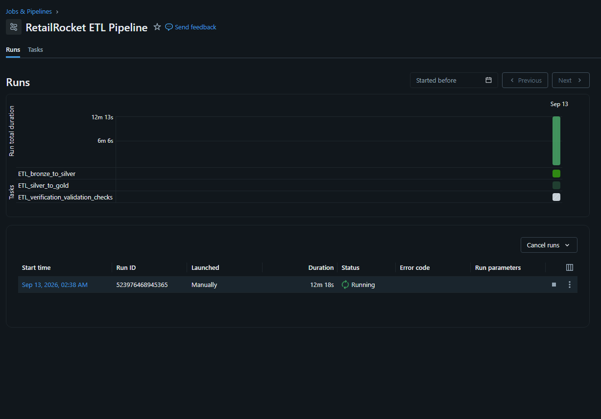
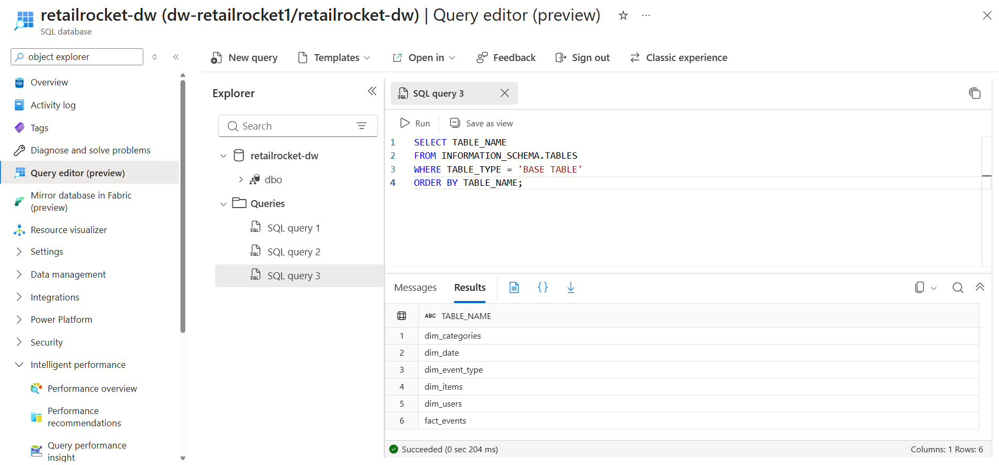
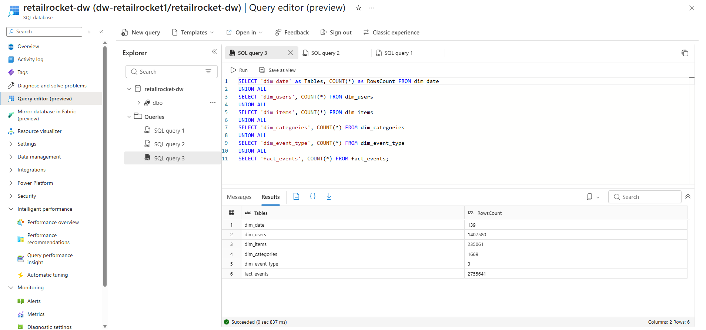
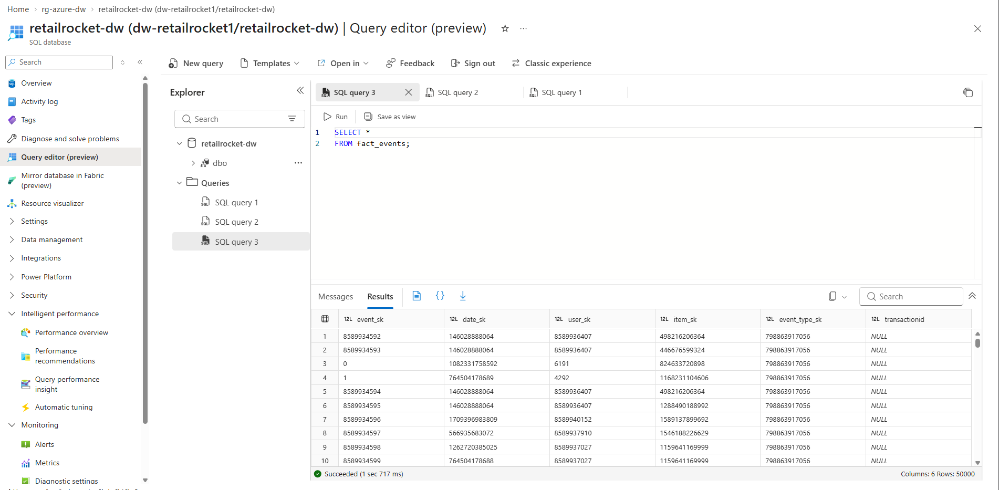

# RetailRocket Data Warehouse using Azure Cloud Services

An end-to-end data warehouse project built on the Microsoft Azure stack, using the [RetailRocket e-commerce dataset](https://www.kaggle.com/datasets/retailrocket/ecommerce-dataset) (~2.7M events) to enable downstream BI analytics in Azure SQL. The pipeline follows a medallion architecture (bronze → silver → gold), models the data as a Kimball star schema (5 dimensions + 1 fact), is deployed with CI/CD via GitHub Actions and scheduled via Azure Data Factory.

**Status:** 🗄️ **Archived** (30 September 2026)
**Stack:** Azure Blob Storage · Azure Databricks (PySpark) · Azure SQL Database · GitHub Actions · Azure Data Factory

> **Why archived?** Access to Azure and Databricks was lost on 30 September 2026. The ETL pipeline was fully working before access loss; The repository is retained as a **case study** and **rebuild reference**.

---

## What This Project Demonstrates

- **Medallion ETL architecture** — bronze (raw) → silver (cleansed) → gold (star schema), with clear separation of concerns
- **Kimball dimensional modeling** — 5 conformed dimensions + 1 fact table at the grain of one user action
- **PySpark transformations** — window functions for SCD Type 1, deterministic surrogate keys, `.cache()` discipline to prevent key regeneration
- **Environment separation** — `dev` branch → `retailrocket_dev` schema; `main` branch → `retailrocket` schema
- **CI/CD** — GitHub Actions workflow deploying via `databricks bundle deploy --target <dev|prod>`
- **Security hygiene** — Databricks secrets scope for all credentials; read-only SQL user for BI (planned); firewall restricted to the developer laptop
- **Data quality validation** — dedicated verification notebook for referential integrity and row-count assertions

---

## Architecture

```
Kaggle RetailRocket CSV
        │
        ▼  manual upload
Azure Blob Storage  (raw/data-retailrocket/)
        │
        ▼  Databricks PySpark
Bronze  ──  raw Delta tables, typed, null-filtered
        │
        ▼  dedup + clean
Silver  ──  cleansed Delta tables, deduplicated, FK-consistent
        │
        ▼  star-schema build
Gold    ──  dim_date, dim_users, dim_items, dim_categories,
        │    dim_event_type, fact_events
        │
        ▼  JDBC bulk load
Azure SQL Database  (retailrocket-dw)
```

**Orchestration:** Databricks Jobs (via `databricks.yml` bundle) · **CI/CD:** GitHub Actions on push to `dev` / `main`

---

## Tech Stack

| Layer | Service | Purpose | Status |
|---|---|---|---|
| Storage | Azure Blob Storage (`stdportfolio`) | Landing zone for raw CSVs (`raw/data-retailrocket/`) | ✅ Built |
| Compute | Azure Databricks (`dbw-retailrocket`) | PySpark notebook execution for ETL | ✅ Built |
| Transformation orchestration | Databricks Jobs (`databricks.yml`) | Executes the ETL notebooks (bronze → silver → gold → verification) in order | ✅ Built |
| Scheduling | Azure Data Factory (`adf-retailrocket`) | Triggers the Databricks ETL job on a scheduled basis | ✅ Built |
| Serving | Azure SQL Database (`retailrocket-dw`) | Star schema for BI consumption | ✅ Built |
| CI/CD | GitHub Actions (`.github/workflows/ci.yml`) | Deploy databricks bundle on push via `databricks bundle deploy` to keep databricks jobs up to date  | Non-functional as of 30/9/26 — depends on Databricks |
| Secrets | Databricks secrets scope (`retailrocket`) | `storage-key`, `sql-password` | ✅ Built |


---

## Star Schema

### Dimensions

| Table            | Grain                     | Key Columns                                                                                                      |
| ---------------- | ------------------------- | ---------------------------------------------------------------------------------------------------------------- |
| `dim_date`       | One row per calendar date | `date_sk`, `full_date`, `year`, `month`, `day`, `day_of_week`, `day_name`, `is_weekend`, `month_name`, `quarter` |
| `dim_users`      | One row per `visitorid`   | `user_sk`, `visitorid`, `first_event_ts`, `last_event_ts`, `total_events`, `total_purchases`, `has_purchased`    |
| `dim_items`      | One row per `itemid`      | `item_sk`, `itemid`, `category_sk`                                                                               |
| `dim_categories` | One row per category      | `category_sk`, `category_id`, `parent_id`, `parent_sk`                                                           |
| `dim_event_type` | One row per event type    | `event_type_sk`, `event_type` (`view` / `cart` / `transaction`)                                                  |

### Fact

| Table         | Grain                   | Columns                                                                       |
| ------------- | ----------------------- | ----------------------------------------------------------------------------- |
| `fact_events` | One row per user action | `event_sk`, `date_sk`, `user_sk`, `item_sk`, `event_type_sk`, `transactionid` |

---

## ETL Pipeline

| Notebook                        | Location  | Purpose                                                           |
| ------------------------------- | --------- | ----------------------------------------------------------------- |
| `EDA.ipynb`                     | `03-eda/` | Full dataset exploration — distributions, null rates, cardinality |
| `etl-bronze-to-silver.ipynb`    | `04-etl/` | Load CSVs → bronze Delta tables; cleanse and dedup → silver       |
| `etl-silver-to-gold.ipynb`      | `04-etl/` | Build star schema; load gold tables into Azure SQL via JDBC       |
| `etl-verification-checks.ipynb` | `04-etl/` | Referential integrity, row-count assertions, orphan-key checks    |

**Execution order is strict:** EDA → bronze-to-silver → silver-to-gold → verification. Each notebook must be run top-to-bottom; individual cells must never be re-run out of order (see Lessons Learned).

---

## Pipeline Evidence

Because the original Azure environment is no longer accessible, the screenshots below are the visual record of the pipeline running end-to-end. They are stored in [`docs/screenshots/`](docs/screenshots/) and are embedded here in the order the work was performed.

### 1. Azure resource provisioning



All Azure resources provisioned under `rg-azure-dw` — storage account `stdportfolio`, Databricks workspace `dbw-retailrocket`, SQL server `dw-retailrocket1` / database `retailrocket-dw`, and the NAT Gateway required for Secure Cluster Connectivity.

### 2. Star schema design



The Kimball dimensional model — 5 conformed dimensions (`dim_date`, `dim_users`, `dim_items`, `dim_categories`, `dim_event_type`) and 1 fact table (`fact_events`) at the grain of one user action.

### 3. Databricks cluster running



The D4ds_v4 cluster in a running state with the 30-minute auto-terminate setting turned on. This was captured while the cluster was functional.

### 4. Secrets scope configuration



The Databricks secrets scope `retailrocket` holding two keys — `storage-key` (Blob account key) and `sql-password` (Azure SQL password). Values are not shown. Demonstrates the security hygiene principle: no credentials in code, all secrets accessed via `dbutils.secrets.get(scope, key)` via Databricks.

### 5. EDA summary



`EDA.ipynb` output cells — row counts per source file, null-rate summary for `visitorid` / `itemid` / `timestamp`, distribution of event types (`view` / `cart` / `transaction`), and confirmation of the timestamp range (May 3 – September 18, 2015). This profiling preceded any transformation and informed the silver-layer cleansing rules.

### 6. Silver → Gold transformation



The gold star-schema build — dimensions and fact table materialized from silver Delta tables. `dim_items` starts from *all* items in `events` (LEFT JOIN to categories) and applies SCD Type 1 for the latest category per item. Wide dimensions (`day_name`, `is_weekend`, `has_purchased`) are populated here.

### 7. ETL job pipeline



The Databricks Job pipeline view — scheduled execution of the ETL notebooks (bronze → silver → gold → verification) with task-level status. Configured via `databricks.yml` with branch-routed targets (`dev` → `retailrocket_dev`, `main` → `retailrocket`).

### 8. Azure SQL — gold tables loaded



Azure SQL Query editor (`retailrocket-dw`) showing the six gold tables created in the `retailrocket` schema. The JDBC bulk load from Databricks succeeded — data is now in the serving layer, ready for BI consumption.

### 9. Azure SQL — row count verification



A row-count query running against each gold table, confirming the loads matched expected cardinality (e.g., `dim_date` ≈ 138 rows for the 138-day period covered by the dataset).

### 10. Azure SQL — fact table verification



A sample analytical query against `fact_events` — showing the fact table populated at the correct grain, with `transactionid` populated only for transaction events. Confirms the warehouse is queryable and supports the analytical patterns the dashboard would have used.

### What was *not* captured

Being honest about gaps:


- **Full CI/CD on `main`** — the `dev` → `main` PR was opened after access loss, so no GitHub Actions instance deployed alongside the PR.


## What Was Built

### Built
- Fully functioning medallion ETL: bronze → silver → gold built from Databricks into Azure SQL Server via Databricks Jobs and Azure Data Factory
- Star schema with 5 dims + 1 fact at the correct grain inside of Azure SQL Database
- Referential-integrity verification notebook (validation)
- GitHub Actions workflow configured for branch-based deploys, successfully validated and updated databricks job definitions prior to access loss.


## Engineering Challenges & Solutions

### 1. Surrogate keys regenerating on every Spark evaluation

`monotonically_increasing_id()` is **non-deterministic** — Spark is lazy, and each `.write()` re-evaluates the entire pipeline from source. Without intervention, the dimension tables get new keys on every write while `fact_events` retains the keys from a previous run. The result: **silent referential integrity breakage**.

**Fix:** call `.cache()` on every dimension DataFrame immediately after assigning the surrogate key. This forces materialization and pins the keys for the rest of the session. All five dimensions in `etl-silver-to-gold.ipynb` end with `.cache()  # Prevent different IDs generated when joining with fact_events.`

### 2. `dim_items` missing uncategorized items

Initial build only included items that appeared in `item_properties` with a `categoryid`. Items without a category were dropped — producing orphan `item_sk` values in `fact_events` for events on those items.

**Fix:** start from `SELECT DISTINCT itemid FROM events`, then LEFT JOIN to categories. Unmatched items get `category_sk = NULL` but retain their `item_sk`.

### 3. SCD Type 1 for category

Items can change categories over time, but `dim_items` should have exactly one row per item.

**Fix:** use a window function to pick the latest `categoryid` per item:
```sql
ROW_NUMBER() OVER (PARTITION BY itemid ORDER BY timestamp_ms DESC) = 1
```

### 4. Azure SQL transient connection failures during JDBC writes

Random "access denied" errors occurred during load-balancing reconfiguration — often mid-write, corrupting partial loads.

**Fix:** add retry parameters to the JDBC URL:
```
connectRetryCount=3;connectRetryInterval=10
```

### 5. Contained database users avoid the master-database requirement

Initial attempts to create `etl_loader` failed with *"User must be in master database."*

**Fix:** Azure SQL supports **contained users** — `CREATE USER ... WITH PASSWORD` runs directly in the target database. No master access required.

### 6. Delta schema merges fail on nullability changes

Changing a column from non-nullable to nullable broke Delta's schema merge (`DELTA_FAILED_TO_MERGE_FIELDS`).

**Fix:** drop the target table before writing when the schema changes:
```python
spark.sql("DROP TABLE IF EXISTS gold.<table_name>")
```

---

## Lessons Learned

### Platform & Infrastructure

- **Cluster-based platforms introduce failures unrelated to the data engineering.** The East Asia region experienced vCPU quota exhaustion, DS3_v2 capacity stockout, and SKU availability grey-out. The cluster worked when it ran; it frequently couldn't be provisioned.
- **Auto-termination is a cost control, not a reliability control.** The 15-minute setting was rejected by the platform — and when it did work, it terminated clusters mid-work, forcing restarts.
- **NAT Gateway is a hidden recurring cost.** Secure Cluster Connectivity required one at ~$1.08/day (~$32/month) — more than the rest of the project combined.
- **A quota is a ceiling; a stockout is a wall.** The free-tier limits (14-day DBUs, 250 DTU SQL) were sufficient on paper, but capacity constraints prevented provisioning.
- **Cloud resources are rented, not owned.** Azure and Databricks access was lost on 30 September 2026. Only the GitHub repository survived. Version-control everything for reproducibility.

### ETL Methodology (Medallion)

- **Silver is not optional.** Bronze = raw load. Silver = clean & dedup. Gold = business logic. Skipping silver leaked cleansing logic into gold.
- **Always run the entire notebook top-to-bottom.** Re-running a single cell regenerates surrogate keys with different values. The fact table retains old keys while dimensions get new ones — silent integrity break.
- **Wide dimensions are a Kimball best practice.** Include deterministic derived attributes (`day_name`, `is_weekend`, `has_purchased`) in the dimension. Keep business logic (segments, thresholds) downstream in the BI layer.
- **Referential-integrity checks are mandatory.** Orphan surrogate keys break Power BI relationships. `etl-verification-checks.ipynb` exists specifically for this.

### Data Characteristics

- **Timestamps are Unix milliseconds, not seconds.** 13-digit values. Divide by 1000 before conversion.
- **`item_properties` is a change log, not a snapshot.** The same item appears many times as attributes change. 90%+ of values are hashed for privacy; only `categoryid` and `available` are readable.
- **`categoryid` is the only category source in the dataset.** It enables category drill-down in downstream BI.

### Security & Process

- **Secrets never belong in code.** All credentials lived in a Databricks secrets scope, accessed via `dbutils.secrets.get(scope, key)`.
- **Contained database users avoid master-database dependency.** `CREATE USER ... WITH PASSWORD` works directly in the target DB.
- **CI/CD coupled to a cloud service dies when the service dies.** The GitHub Actions workflow depends on a live Databricks workspace and a valid PAT. When access was lost, the workflow became non-functional.

---

## Repository Structure

```
azure-databricks-datawarehouse/
├── README.md
├── databricks.yml                       # Databricks bundle config (jobs + targets)
├── .gitignore
├── .github/
│   └── workflows/
│       └── ci.yml                       # ⚠️ Non-functional — depends on Databricks
│
├── 01-infra/
│   ├── README.md                        # Audit map: resource shells + content map
│   └── *.bicep                          # Exported resource snapshots from Portal
│
├── 02-data/
│   ├── README.md
│   └── samples/                         # 1,000-row CSVs (runnable without cloud)
│
├── 03-eda/
│   └── EDA.ipynb                        # Full dataset exploration
│
├── 04-etl/
│   ├── etl-bronze-to-silver.ipynb       # Bronze load + silver clean/dedup
│   ├── etl-silver-to-gold.ipynb         # Star schema + Azure SQL load
│   └── etl-verification-checks.ipynb    # Data quality validation
│
└── docs/
    └── screenshots/                     # Pipeline evidence (embedded above)
        ├── azure_resource_group_creation.png
        ├── azure_dw_schema.png
        ├── db_cluster_use.png
        ├── databricks_secret_scoping.png
        ├── eda_summary_in_databricks.png
        ├── db_silver_to_gold_load.png
        ├── ETL_job_pipeline.png
        ├── azure_sql_verify_dw.png
        ├── azure_sql_verify_dw_row_counts.png
        └── azure_sql_verify_fact_table.png
```

**Branch note:** All work lives on the `dev` branch. The `dev` → `main` PR was never opened, so `main` is incomplete.

---

## Rebuild Guide

If access is restored or a fresh Azure subscription is used, the project can be rebuilt from this repo.

### Prerequisites
- Azure subscription (or Azure for Students)
- Databricks workspace (Premium tier, East Asia region)
- Raw CSVs from [Kaggle](https://www.kaggle.com/datasets/retailrocket/ecommerce-dataset) — stored locally as backup

### Setup steps

1. **Azure resources** — resource group `rg-azure-dw`; storage account `stdportfolio` with `raw/data-retailrocket/` container; SQL server `dw-retailrocket1` with database `retailrocket-dw`
2. **Databricks** — workspace `dbw-retailrocket`, single-node DS3_v2 cluster, 15-min auto-terminate
3. **Secrets** — create scope `retailrocket`; add `storage-key` (Blob account key) and `sql-password` (SQL password)
4. **Azure SQL** — enable firewall rule *"Allow Azure services and resources to access this server"*; create contained user:
   ```sql
   CREATE USER etl_loader WITH PASSWORD='<password>';
   ALTER ROLE db_datawriter ADD MEMBER etl_loader;
   ALTER ROLE db_datareader ADD MEMBER etl_loader;
   ALTER ROLE db_ddladmin   ADD MEMBER etl_loader;
   ```
5. **GitHub** — generate a fine-grained PAT (Contents Read/Write); connect Databricks Git folder to this repo
6. **CI/CD** — set repository secrets `DATABRICKS_HOST` and `DATABRICKS_TOKEN` to the new workspace URL and PAT
7. **Run ETL** — execute notebooks in order: `EDA.ipynb` → `etl-bronze-to-silver.ipynb` → `etl-silver-to-gold.ipynb` → `etl-verification-checks.ipynb`
8. **Power BI** *(future implementation)* — connect to Azure SQL, import gold tables, build dashboards for conversion funnel analytics

### Known gotchas

| Symptom                                | Fix                                                                                                           |
| -------------------------------------- | ------------------------------------------------------------------------------------------------------------- |
| `SCHEMA_NOT_FOUND`                     | Run `spark.sql("CREATE SCHEMA IF NOT EXISTS bronze")` before writing                                          |
| `wasbs://` path errors                 | Confirm storage account name is `stdportfolio` (no `w`)                                                       |
| JDBC "access denied" (intermittent)    | Add `connectRetryCount=3;connectRetryInterval=10` to the JDBC URL                                             |
| `User must be in master database`      | Use contained-user auth — `CREATE USER ... WITH PASSWORD` in the target DB                                    |
| `DELTA_FAILED_TO_MERGE_FIELDS`         | Drop the target table first: `spark.sql("DROP TABLE IF EXISTS gold.<table>")`                                 |
| Orphan surrogate keys in `fact_events` | Confirm every dimension DataFrame has `.cache()` after `monotonically_increasing_id()`                        |
| CI/CD workflow fails on push           | Expected — Databricks access lost. Re-provision a workspace and update `DATABRICKS_HOST` / `DATABRICKS_TOKEN` |

---

## Cost

| Resource                     | Approx. Cost            | Notes                                                      |
| ---------------------------- | ----------------------- | ---------------------------------------------------------- |
| Azure Databricks             | Free tier (14-day DBUs) | Auto-terminate clusters aggressively                       |
| Azure SQL Database           | Free tier (250 DTU)     | Basic tier is sufficient                                   |
| Azure Blob Storage           | Negligible              | ~900 MB of raw CSVs                                        |
| NAT Gateway                  | ~$1.08/day (~$32/mo)    | Required for Secure Cluster Connectivity; delete when idle |
| **Total (project duration)** | **~$30–40**             | —                                                          |

---

## Acknowledgments

- **Dataset:** [RetailRocket Recommender System](https://www.kaggle.com/datasets/retailrocket/ecommerce-dataset) — 2,756,101 events, May 3 – September 18, 2015, Netherlands
- **Modeling approach:** Kimball dimensional modeling — wide dimensions, SCD Type 1, surrogate keys

---

## License

MIT — see [LICENSE](LICENSE).